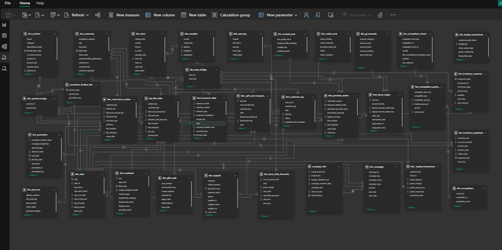

markdown

# 📊 Data Modelling & Gold Layer Transformation

**Power BI Semantic Model · Power Query (M) Transformations**

---

## 📁 Project Overview

This document outlines the data modelling process for the Blue Canopy Retail Analytics Project. I built the **entire dimensional model directly in Power BI** using Power Query (M language). Starting from 31 raw silver-layer tables imported from SQL Server, I transformed them into a production-ready **GALAXY SCHEMA**.

**Key Stats:**
- ✅ **31 Silver Tables** → **15 Gold Objects**
- ✅ **6 Conformed Dimensions** (shared across all data marts)
- ✅ **9 Atomic Fact Tables** (transactional grain)
- ✅ **3 Aggregate Tables** (pre-summed for performance)
- ✅ **2 Bridge Table** (many-to-many resolution) i.e dim_products_bridge and dim_stores_bridge

---

## 📁 Tables Before Data Modelling (Raw Silver Layer)

---

## 📁 Tables After Data Modelling (Gold Layer)

---

## 🏗️ Architecture Overview

SQL Server (Silver Layer)
↓ [Import Mode]
Power BI Desktop
↓ [Power Query - M Language]
Gold Layer (Power Query transforms)
↓ [Model Relationships]
Power BI Semantic Model (Star Schema)
↓ [DAX Measures]
5 Data Marts → Interactive Dashboards
text

---

## 📊 Gold Layer Objects Summary

### Dimension Tables (8 Total)

| Table | SCD Type | Purpose |
|-------|----------|---------|
| **dim_date** | - | Date calendar for all time-based analysis |
| **dim_customer** | Type 1 | Customer master for all customer-facing analysis |
| **dim_product** | Type 2 | Product master with historical price/cost tracking |
| **dim_store** | Type 2 | Store master with geography enrichment |
| **dim_employee** | Type 2 | Employee dimension for HR and sales attribution |
| **dim_supplier** | Type 1 | Supplier reference for procurement |
| **dim_campaign** | Type 1 | Marketing campaign attribution |
| **dim_geography_economic** | - | County geography with economic indicators |

### Fact Tables (9 Atomic)

| Table | Grain | Pattern | Key Dimensions |
|-------|-------|---------|----------------|
| **fact_pos_sales** | One row per POS line | Transaction | date, customer, product, store, employee |
| **fact_ecommerce_sales** | One row per order line | Transaction | date, customer, product, store |
| **fact_returns** | One row per return event | Transaction | date, product, store, customer |
| **fact_loyalty** | One row per loyalty event | Transaction | date, customer |
| **fact_inventory_movements** | One row per movement | Transaction | date, product, store |
| **fact_procurement** | One row per PO line | Accumulating Snapshot | date (3x), product, supplier |
| **fact_customer_experience** | One row per feedback | Transaction | date, customer |
| **fact_gift_card** | One row per transaction | Transaction | date, customer |
| **fact_time_attendance** | One row per clock event | Transaction | date, employee, store |

### Aggregate & Bridge Tables

| Table | Grain | Purpose |
|-------|-------|---------|
| **agg_store_financials** | One row per store per day | Fast P&L analysis |
| **agg_inventory_snapshot** | One row per product/store/day | Fast inventory position |
| **agg_competitor_benchmark** | One row per competitor per quarter | Market share analysis |
| **bridge_promotion_product** | One row per promotion-product pair | M2M resolution |

---

## 🏢 Data Marts (5 Subject Areas)

| Mart | Primary Fact Tables | Key Metrics |
|------|---------------------|-------------|
| **Sales & Revenue** | fact_pos_sales, fact_ecommerce_sales, fact_returns | Revenue, AOV, Gross Margin, Return Rate, Campaign ROI |
| **Customer & Loyalty** | fact_loyalty, fact_customer_experience | Active Customers, Churn Rate, NPS, Loyalty Redemption |
| **Inventory & Supply Chain** | fact_inventory_movements, fact_procurement, agg_inventory_snapshot | Stockouts, Turnover, Supplier OTD, Lead Time Variance |
| **Finance & Store P&L** | agg_store_financials | Net Profit, Operating Margin, Revenue/SqM |
| **HR & Workforce** | fact_time_attendance | Headcount, Retention Risk, Gender Diversity, Attendance |

---

## 🛠️ Tools Used

- **Power BI Desktop** - Data modelling, Power Query (M) transformations, DAX measures
- **SQL Server** - Source data (Silver Layer)
- **Tabular Editor** - Calculation groups and advanced modelling
- **DAX Studio** - Performance optimisation and measure testing

us Matrix – Relationship Overview

Below is the interactive Data Warehouse Bus Matrix showing which conformed dimensions are used by each business process (fact table).
<table> <tr> <th colspan="2" style="background: #0A0A0F; color: #00F5FF; padding: 8px; border: 1px solid #2A2A3D;">Data Warehouse Bus Matrix — Retail BI Kenya</th> </tr> <tr> <td colspan="2" style="background: #0A0A0F; padding: 8px; border: 1px solid #2A2A3D;"> 
 PK Direct FK RP Role-Playing SN Snapshot BR Bridge DG Degenerate OT Outrigger 
 </td> </tr> </table><!-- Matrix Table --><table> <thead> <tr> <th style="position:sticky;left:0;z-index:10;background:#1A1A2E;border:1px solid #2A2A3D;padding:8px 12px;min-width:200px;width:200px;text-align:left;font-size:11px;color:#9090CC;font-weight:600;text-transform:uppercase;letter-spacing:0.07em;">Business Process Gold Layer Fact</th> <th style="background:#1A1A2E;border:1px solid #2A2A3D;padding:4px 6px;min-width:60px;width:60px;text-align:center;vertical-align:bottom;font-size:10px;color:#9090CC;font-weight:600;">date</th> <th style="background:#1A1A2E;border:1px solid #2A2A3D;padding:4px 6px;min-width:60px;width:60px;text-align:center;vertical-align:bottom;font-size:10px;color:#9090CC;font-weight:600;">customer</th> <th style="background:#1A1A2E;border:1px solid #2A2A3D;padding:4px 6px;min-width:60px;width:60px;text-align:center;vertical-align:bottom;font-size:10px;color:#9090CC;font-weight:600;">product</th> <th style="background:#1A1A2E;border:1px solid #2A2A3D;padding:4px 6px;min-width:60px;width:60px;text-align:center;vertical-align:bottom;font-size:10px;color:#9090CC;font-weight:600;">store</th> <th style="background:#1A1A2E;border:1px solid #2A2A3D;padding:4px 6px;min-width:60px;width:60px;text-align:center;vertical-align:bottom;font-size:10px;color:#9090CC;font-weight:600;">employee</th> <th style="background:#1A1A2E;border:1px solid #2A2A3D;padding:4px 6px;min-width:60px;width:60px;text-align:center;vertical-align:bottom;font-size:10px;color:#9090CC;font-weight:600;">supplier</th> <th style="background:#1A1A2E;border:1px solid #2A2A3D;padding:4px 6px;min-width:60px;width:60px;text-align:center;vertical-align:bottom;font-size:10px;color:#9090CC;font-weight:600;">campaign</th> <th style="background:#1A1A2E;border:1px solid #2A2A3D;padding:4px 6px;min-width:60px;width:60px;text-align:center;vertical-align:bottom;font-size:10px;color:#9090CC;font-weight:600;">promotion</th> <th style="background:#1A1A2E;border:1px solid #2A2A3D;padding:4px 6px;min-width:60px;width:60px;text-align:center;vertical-align:bottom;font-size:10px;color:#9090CC;font-weight:600;">geo_eco</th> <th style="background:#1A1A2E;border:1px solid #2A2A3D;padding:4px 6px;min-width:60px;width:60px;text-align:center;vertical-align:bottom;font-size:10px;color:#9090CC;font-weight:600;">cust_beh</th> </tr> </thead> <tbody> <tr><td style="position:sticky;left:0;z-index:5;background:#13131F;border:1px solid #2A2A3D;padding:6px 12px;min-width:200px;width:200px;">In-Store POS Sales fact_pos_sales</td><td style="border:1px solid #2A2A3D;text-align:center;vertical-align:middle;padding:2px;background:#13131F;">
PK
</td><td style="border:1px solid #2A2A3D;text-align:center;vertical-align:middle;padding:2px;background:#13131F;">
PK
</td><td style="border:1px solid #2A2A3D;text-align:center;vertical-align:middle;padding:2px;background:#13131F;">
PK
</td><td style="border:1px solid #2A2A3D;text-align:center;vertical-align:middle;padding:2px;background:#13131F;">
PK
</td><td style="border:1px solid #2A2A3D;text-align:center;vertical-align:middle;padding:2px;background:#13131F;">
PK
</td><td style="border:1px solid #2A2A3D;text-align:center;vertical-align:middle;padding:2px;background:#13131F;">
·
</td><td style="border:1px solid #2A2A3D;text-align:center;vertical-align:middle;padding:2px;background:#13131F;">
PK
</td><td style="border:1px solid #2A2A3D;text-align:center;vertical-align:middle;padding:2px;background:#13131F;">
BR
</td><td style="border:1px solid #2A2A3D;text-align:center;vertical-align:middle;padding:2px;background:#13131F;">
OT
</td><td style="border:1px solid #2A2A3D;text-align:center;vertical-align:middle;padding:2px;background:#13131F;">
PK
</td></tr> <tr><td style="position:sticky;left:0;z-index:5;background:#13131F;border:1px solid #2A2A3D;padding:6px 12px;min-width:200px;width:200px;">E-Commerce Sales fact_ecommerce_sales</td><td style="border:1px solid #2A2A3D;text-align:center;vertical-align:middle;padding:2px;background:#13131F;">
PK
</td><td style="border:1px solid #2A2A3D;text-align:center;vertical-align:middle;padding:2px;background:#13131F;">
PK
</td><td style="border:1px solid #2A2A3D;text-align:center;vertical-align:middle;padding:2px;background:#13131F;">
PK
</td><td style="border:1px solid #2A2A3D;text-align:center;vertical-align:middle;padding:2px;background:#13131F;">
·
</td><td style="border:1px solid #2A2A3D;text-align:center;vertical-align:middle;padding:2px;background:#13131F;">
·
</td><td style="border:1px solid #2A2A3D;text-align:center;vertical-align:middle;padding:2px;background:#13131F;">
·
</td><td style="border:1px solid #2A2A3D;text-align:center;vertical-align:middle;padding:2px;background:#13131F;">
PK
</td><td style="border:1px solid #2A2A3D;text-align:center;vertical-align:middle;padding:2px;background:#13131F;">
BR
</td><td style="border:1px solid #2A2A3D;text-align:center;vertical-align:middle;padding:2px;background:#13131F;">
OT
</td><td style="border:1px solid #2A2A3D;text-align:center;vertical-align:middle;padding:2px;background:#13131F;">
PK
</td></tr> <tr><td style="position:sticky;left:0;z-index:5;background:#13131F;border:1px solid #2A2A3D;padding:6px 12px;min-width:200px;width:200px;">Product Returns fact_returns</td><td style="border:1px solid #2A2A3D;text-align:center;vertical-align:middle;padding:2px;background:#13131F;">
RP
</td><td style="border:1px solid #2A2A3D;text-align:center;vertical-align:middle;padding:2px;background:#13131F;">
OT
</td><td style="border:1px solid #2A2A3D;text-align:center;vertical-align:middle;padding:2px;background:#13131F;">
PK
</td><td style="border:1px solid #2A2A3D;text-align:center;vertical-align:middle;padding:2px;background:#13131F;">
OT
</td><td style="border:1px solid #2A2A3D;text-align:center;vertical-align:middle;padding:2px;background:#13131F;">
·
</td><td style="border:1px solid #2A2A3D;text-align:center;vertical-align:middle;padding:2px;background:#13131F;">
·
</td><td style="border:1px solid #2A2A3D;text-align:center;vertical-align:middle;padding:2px;background:#13131F;">
·
</td><td style="border:1px solid #2A2A3D;text-align:center;vertical-align:middle;padding:2px;background:#13131F;">
·
</td><td style="border:1px solid #2A2A3D;text-align:center;vertical-align:middle;padding:2px;background:#13131F;">
·
</td><td style="border:1px solid #2A2A3D;text-align:center;vertical-align:middle;padding:2px;background:#13131F;">
·
</td></tr> <tr><td style="position:sticky;left:0;z-index:5;background:#13131F;border:1px solid #2A2A3D;padding:6px 12px;min-width:200px;width:200px;">Loyalty Programme fact_loyalty</td><td style="border:1px solid #2A2A3D;text-align:center;vertical-align:middle;padding:2px;background:#13131F;">
PK
</td><td style="border:1px solid #2A2A3D;text-align:center;vertical-align:middle;padding:2px;background:#13131F;">
PK
</td><td style="border:1px solid #2A2A3D;text-align:center;vertical-align:middle;padding:2px;background:#13131F;">
·
</td><td style="border:1px solid #2A2A3D;text-align:center;vertical-align:middle;padding:2px;background:#13131F;">
·
</td><td style="border:1px solid #2A2A3D;text-align:center;vertical-align:middle;padding:2px;background:#13131F;">
·
</td><td style="border:1px solid #2A2A3D;text-align:center;vertical-align:middle;padding:2px;background:#13131F;">
·
</td><td style="border:1px solid #2A2A3D;text-align:center;vertical-align:middle;padding:2px;background:#13131F;">
OT
</td><td style="border:1px solid #2A2A3D;text-align:center;vertical-align:middle;padding:2px;background:#13131F;">
·
</td><td style="border:1px solid #2A2A3D;text-align:center;vertical-align:middle;padding:2px;background:#13131F;">
·
</td><td style="border:1px solid #2A2A3D;text-align:center;vertical-align:middle;padding:2px;background:#13131F;">
PK
</td></tr> <tr><td style="position:sticky;left:0;z-index:5;background:#13131F;border:1px solid #2A2A3D;padding:6px 12px;min-width:200px;width:200px;">Customer Experience fact_customer_experience</td><td style="border:1px solid #2A2A3D;text-align:center;vertical-align:middle;padding:2px;background:#13131F;">
PK
</td><td style="border:1px solid #2A2A3D;text-align:center;vertical-align:middle;padding:2px;background:#13131F;">
PK
</td><td style="border:1px solid #2A2A3D;text-align:center;vertical-align:middle;padding:2px;background:#13131F;">
·
</td><td style="border:1px solid #2A2A3D;text-align:center;vertical-align:middle;padding:2px;background:#13131F;">
OT
</td><td style="border:1px solid #2A2A3D;text-align:center;vertical-align:middle;padding:2px;background:#13131F;">
·
</td><td style="border:1px solid #2A2A3D;text-align:center;vertical-align:middle;padding:2px;background:#13131F;">
·
</td><td style="border:1px solid #2A2A3D;text-align:center;vertical-align:middle;padding:2px;background:#13131F;">
·
</td><td style="border:1px solid #2A2A3D;text-align:center;vertical-align:middle;padding:2px;background:#13131F;">
·
</td><td style="border:1px solid #2A2A3D;text-align:center;vertical-align:middle;padding:2px;background:#13131F;">
OT
</td><td style="border:1px solid #2A2A3D;text-align:center;vertical-align:middle;padding:2px;background:#13131F;">
·
</td></tr> <tr><td style="position:sticky;left:0;z-index:5;background:#13131F;border:1px solid #2A2A3D;padding:6px 12px;min-width:200px;width:200px;">Inventory Movements fact_inventory_movements</td><td style="border:1px solid #2A2A3D;text-align:center;vertical-align:middle;padding:2px;background:#13131F;">
PK
</td><td style="border:1px solid #2A2A3D;text-align:center;vertical-align:middle;padding:2px;background:#13131F;">
·
</td><td style="border:1px solid #2A2A3D;text-align:center;vertical-align:middle;padding:2px;background:#13131F;">
PK
</td><td style="border:1px solid #2A2A3D;text-align:center;vertical-align:middle;padding:2px;background:#13131F;">
PK
</td><td style="border:1px solid #2A2A3D;text-align:center;vertical-align:middle;padding:2px;background:#13131F;">
·
</td><td style="border:1px solid #2A2A3D;text-align:center;vertical-align:middle;padding:2px;background:#13131F;">
OT
</td><td style="border:1px solid #2A2A3D;text-align:center;vertical-align:middle;padding:2px;background:#13131F;">
·
</td><td style="border:1px solid #2A2A3D;text-align:center;vertical-align:middle;padding:2px;background:#13131F;">
·
</td><td style="border:1px solid #2A2A3D;text-align:center;vertical-align:middle;padding:2px;background:#13131F;">
·
</td><td style="border:1px solid #2A2A3D;text-align:center;vertical-align:middle;padding:2px;background:#13131F;">
·
</td></tr> <tr><td style="position:sticky;left:0;z-index:5;background:#13131F;border:1px solid #2A2A3D;padding:6px 12px;min-width:200px;width:200px;">Inventory Snapshot agg_inventory_snapshot</td><td style="border:1px solid #2A2A3D;text-align:center;vertical-align:middle;padding:2px;background:#13131F;">
SN
</td><td style="border:1px solid #2A2A3D;text-align:center;vertical-align:middle;padding:2px;background:#13131F;">
·
</td><td style="border:1px solid #2A2A3D;text-align:center;vertical-align:middle;padding:2px;background:#13131F;">
SN
</td><td style="border:1px solid #2A2A3D;text-align:center;vertical-align:middle;padding:2px;background:#13131F;">
SN
</td><td style="border:1px solid #2A2A3D;text-align:center;vertical-align:middle;padding:2px;background:#13131F;">
·
</td><td style="border:1px solid #2A2A3D;text-align:center;vertical-align:middle;padding:2px;background:#13131F;">
OT
</td><td style="border:1px solid #2A2A3D;text-align:center;vertical-align:middle;padding:2px;background:#13131F;">
·
</td><td style="border:1px solid #2A2A3D;text-align:center;vertical-align:middle;padding:2px;background:#13131F;">
·
</td><td style="border:1px solid #2A2A3D;text-align:center;vertical-align:middle;padding:2px;background:#13131F;">
·
</td><td style="border:1px solid #2A2A3D;text-align:center;vertical-align:middle;padding:2px;background:#13131F;">
·
</td></tr> <tr><td style="position:sticky;left:0;z-index:5;background:#13131F;border:1px solid #2A2A3D;padding:6px 12px;min-width:200px;width:200px;">Procurement (PO) fact_procurement</td><td style="border:1px solid #2A2A3D;text-align:center;vertical-align:middle;padding:2px;background:#13131F;">
RP
</td><td style="border:1px solid #2A2A3D;text-align:center;vertical-align:middle;padding:2px;background:#13131F;">
·
</td><td style="border:1px solid #2A2A3D;text-align:center;vertical-align:middle;padding:2px;background:#13131F;">
PK
</td><td style="border:1px solid #2A2A3D;text-align:center;vertical-align:middle;padding:2px;background:#13131F;">
OT
</td><td style="border:1px solid #2A2A3D;text-align:center;vertical-align:middle;padding:2px;background:#13131F;">
·
</td><td style="border:1px solid #2A2A3D;text-align:center;vertical-align:middle;padding:2px;background:#13131F;">
PK
</td><td style="border:1px solid #2A2A3D;text-align:center;vertical-align:middle;padding:2px;background:#13131F;">
·
</td><td style="border:1px solid #2A2A3D;text-align:center;vertical-align:middle;padding:2px;background:#13131F;">
·
</td><td style="border:1px solid #2A2A3D;text-align:center;vertical-align:middle;padding:2px;background:#13131F;">
·
</td><td style="border:1px solid #2A2A3D;text-align:center;vertical-align:middle;padding:2px;background:#13131F;">
·
</td></tr> <tr><td style="position:sticky;left:0;z-index:5;background:#13131F;border:1px solid #2A2A3D;padding:6px 12px;min-width:200px;width:200px;">Store Daily Financials agg_store_financials</td><td style="border:1px solid #2A2A3D;text-align:center;vertical-align:middle;padding:2px;background:#13131F;">
SN
</td><td style="border:1px solid #2A2A3D;text-align:center;vertical-align:middle;padding:2px;background:#13131F;">
·
</td><td style="border:1px solid #2A2A3D;text-align:center;vertical-align:middle;padding:2px;background:#13131F;">
·
</td><td style="border:1px solid #2A2A3D;text-align:center;vertical-align:middle;padding:2px;background:#13131F;">
SN
</td><td style="border:1px solid #2A2A3D;text-align:center;vertical-align:middle;padding:2px;background:#13131F;">
·
</td><td style="border:1px solid #2A2A3D;text-align:center;vertical-align:middle;padding:2px;background:#13131F;">
·
</td><td style="border:1px solid #2A2A3D;text-align:center;vertical-align:middle;padding:2px;background:#13131F;">
·
</td><td style="border:1px solid #2A2A3D;text-align:center;vertical-align:middle;padding:2px;background:#13131F;">
·
</td><td style="border:1px solid #2A2A3D;text-align:center;vertical-align:middle;padding:2px;background:#13131F;">
OT
</td><td style="border:1px solid #2A2A3D;text-align:center;vertical-align:middle;padding:2px;background:#13131F;">
·
</td></tr> <tr><td style="position:sticky;left:0;z-index:5;background:#13131F;border:1px solid #2A2A3D;padding:6px 12px;min-width:200px;width:200px;">Gift Card Transactions fact_gift_card</td><td style="border:1px solid #2A2A3D;text-align:center;vertical-align:middle;padding:2px;background:#13131F;">
PK
</td><td style="border:1px solid #2A2A3D;text-align:center;vertical-align:middle;padding:2px;background:#13131F;">
OT
</td><td style="border:1px solid #2A2A3D;text-align:center;vertical-align:middle;padding:2px;background:#13131F;">
·
</td><td style="border:1px solid #2A2A3D;text-align:center;vertical-align:middle;padding:2px;background:#13131F;">
OT
</td><td style="border:1px solid #2A2A3D;text-align:center;vertical-align:middle;padding:2px;background:#13131F;">
·
</td><td style="border:1px solid #2A2A3D;text-align:center;vertical-align:middle;padding:2px;background:#13131F;">
·
</td><td style="border:1px solid #2A2A3D;text-align:center;vertical-align:middle;padding:2px;background:#13131F;">
·
</td><td style="border:1px solid #2A2A3D;text-align:center;vertical-align:middle;padding:2px;background:#13131F;">
·
</td><td style="border:1px solid #2A2A3D;text-align:center;vertical-align:middle;padding:2px;background:#13131F;">
·
</td><td style="border:1px solid #2A2A3D;text-align:center;vertical-align:middle;padding:2px;background:#13131F;">
·
</td></tr> <tr><td style="position:sticky;left:0;z-index:5;background:#13131F;border:1px solid #2A2A3D;padding:6px 12px;min-width:200px;width:200px;">Time & Attendance fact_time_attendance</td><td style="border:1px solid #2A2A3D;text-align:center;vertical-align:middle;padding:2px;background:#13131F;">
PK
</td><td style="border:1px solid #2A2A3D;text-align:center;vertical-align:middle;padding:2px;background:#13131F;">
·
</td><td style="border:1px solid #2A2A3D;text-align:center;vertical-align:middle;padding:2px;background:#13131F;">
·
</td><td style="border:1px solid #2A2A3D;text-align:center;vertical-align:middle;padding:2px;background:#13131F;">
PK
</td><td style="border:1px solid #2A2A3D;text-align:center;vertical-align:middle;padding:2px;background:#13131F;">
PK
</td><td style="border:1px solid #2A2A3D;text-align:center;vertical-align:middle;padding:2px;background:#13131F;">
·
</td><td style="border:1px solid #2A2A3D;text-align:center;vertical-align:middle;padding:2px;background:#13131F;">
·
</td><td style="border:1px solid #2A2A3D;text-align:center;vertical-align:middle;padding:2px;background:#13131F;">
·
</td><td style="border:1px solid #2A2A3D;text-align:center;vertical-align:middle;padding:2px;background:#13131F;">
·
</td><td style="border:1px solid #2A2A3D;text-align:center;vertical-align:middle;padding:2px;background:#13131F;">
·
</td></tr> <tr><td style="position:sticky;left:0;z-index:5;background:#13131F;border:1px solid #2A2A3D;padding:6px 12px;min-width:200px;width:200px;">Competitor Benchmarks agg_competitor_benchmark</td><td style="border:1px solid #2A2A3D;text-align:center;vertical-align:middle;padding:2px;background:#13131F;">
DG
</td><td style="border:1px solid #2A2A3D;text-align:center;vertical-align:middle;padding:2px;background:#13131F;">
·
</td><td style="border:1px solid #2A2A3D;text-align:center;vertical-align:middle;padding:2px;background:#13131F;">
·
</td><td style="border:1px solid #2A2A3D;text-align:center;vertical-align:middle;padding:2px;background:#13131F;">
·
</td><td style="border:1px solid #2A2A3D;text-align:center;vertical-align:middle;padding:2px;background:#13131F;">
·
</td><td style="border:1px solid #2A2A3D;text-align:center;vertical-align:middle;padding:2px;background:#13131F;">
·
</td><td style="border:1px solid #2A2A3D;text-align:center;vertical-align:middle;padding:2px;background:#13131F;">
·
</td><td style="border:1px solid #2A2A3D;text-align:center;vertical-align:middle;padding:2px;background:#13131F;">
·
</td><td style="border:1px solid #2A2A3D;text-align:center;vertical-align:middle;padding:2px;background:#13131F;">
OT
</td><td style="border:1px solid #2A2A3D;text-align:center;vertical-align:middle;padding:2px;background:#13131F;">
·
</td></tr> </tbody> </table>

Legend:
---

## 🤝 Connect

**Junior Kevin** · [LinkedIn](https://www.linkedin.com/in/junior-kevin-a7a901276/)

---

*"The goal of data modelling is not just to store data, but to make it discoverable, trustworthy, and actionable."*
